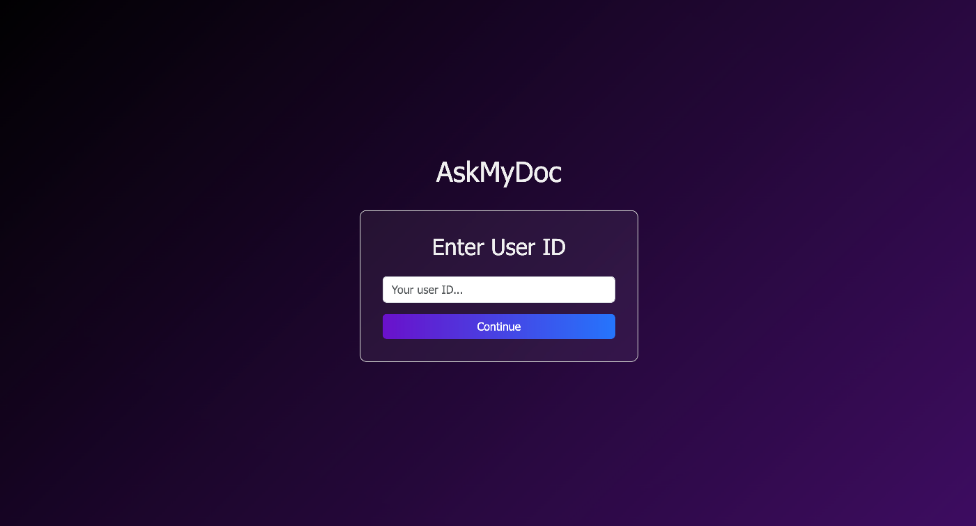
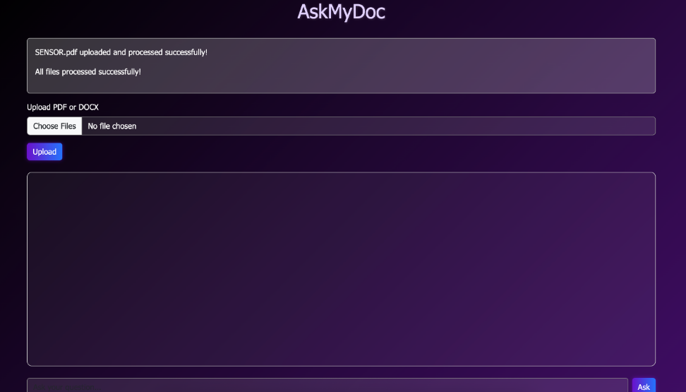
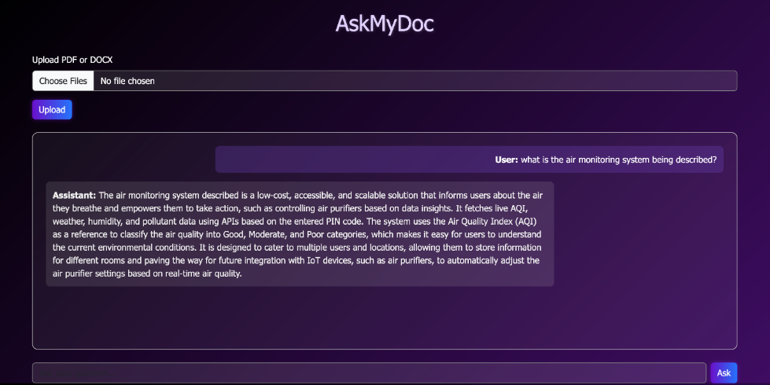
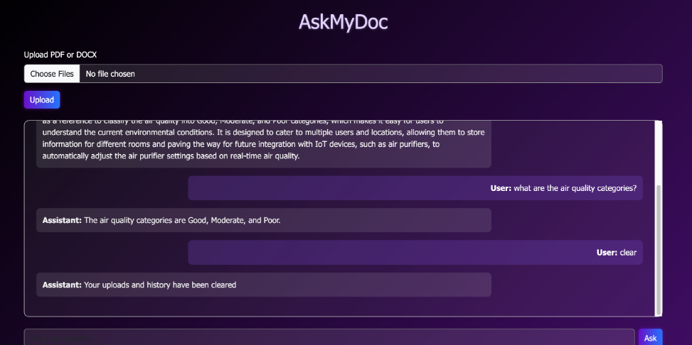

# 📄 AskMyDoc

AskMyDoc is an AI-powered document analysis platform that leverages **Retrieval-Augmented Generation (RAG)** and **Large Language Models (LLMs)** to help users understand complex documents through natural language conversations.

Upload PDF or DOCX files, ask questions about their contents, and receive accurate, context-aware responses instantly.

---

## 🚀 Features

### 🤖 AI-Powered Question Answering

Ask questions in natural language and receive intelligent, context-aware answers based on your uploaded documents.

### 📂 Multi-Document Support

Upload multiple PDF and DOCX files within the same session and query information across all documents.

### 💬 Multi-Chat Sessions

Work on different projects independently using unique user IDs. Each user maintains a separate document and chat history.

### 🧹 Clear Chat History

Reset your workspace anytime by simply typing:

```text
clear
```

This removes uploaded documents and conversation history for the current session.

### 🧠 Retrieval-Augmented Generation (RAG)

Uses semantic search and vector embeddings to retrieve the most relevant document sections before generating responses.

### 🔍 Semantic Document Search

Find information based on meaning rather than exact keyword matching.

---

## 🏗️ Architecture

```text
PDF / DOCX Upload
        │
        ▼
Document Processing
        │
        ▼
Text Chunking
        │
        ▼
HuggingFace Embeddings
        │
        ▼
FAISS Vector Database
        │
        ▼
Relevant Context Retrieval
        │
        ▼
Gemini 2.0 Flash
        │
        ▼
Context-Aware Response
```

---

## 🛠️ Tech Stack

### Frontend

* Flask
* HTML
* CSS
* JavaScript

### Backend

* FastAPI
* Python

### AI & RAG

* Google Gemini 2.0 Flash
* LangChain
* FAISS Vector Store
* HuggingFace Embeddings
* Conversational Retrieval Chain

### Database

* MongoDB

### Document Processing

* PyPDF
* python-docx

---

## 📸 Screenshots

### Image 1


### Image 2


### Image 3



### Image 5


## ⚙️ Installation

### Clone the Repository

```bash
git clone <repository-url>
cd AskMyDoc
```

### Create Virtual Environment

```bash
python -m venv venv
```

### Activate Virtual Environment

Windows:

```bash
venv\Scripts\activate
```

Linux/macOS:

```bash
source venv/bin/activate
```

### Install Dependencies

```bash
pip install -r requirements.txt
```

### Configure Environment Variables

Create a `.env` file and add:

```env
GEMINI_API_KEY=your_api_key
MONGO_URI=your_mongodb_connection_string
```

### Run the Application

```bash
python app.py
```

---

## 🎯 Use Cases

* Research Paper Analysis
* Academic Study Assistant
* Legal Document Exploration
* Business Report Analysis
* Technical Documentation Search
* Knowledge Base Querying

---

## 🔮 Future Enhancements

* Source citations and references
* Voice-based document interaction
* OCR support for scanned PDFs
* Role-based authentication
* Cloud deployment with Docker
* Hybrid keyword + semantic retrieval
* Document summarization

---

## 👨‍💻 Learning Outcomes

This project demonstrates practical experience with:

* Retrieval-Augmented Generation (RAG)
* Large Language Models (LLMs)
* Vector Databases
* Semantic Search
* Prompt Engineering
* FastAPI Development
* MongoDB Integration
* Full-Stack AI Applications

---

## 📜 License

This project is intended for educational and research purposes.
